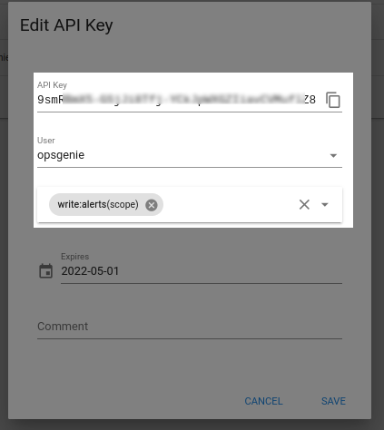

Set up OpsGenie with an OpsGenie Edge Connector integration.
==================

While the OpsGenie plugin provided by Alerta can send alerts to OpsGenie it does not allow OpsGenie to update Alerta. 
Fortunately, OpsGenie has an edge connector we can install and configure to use some code to do this for us. 

Set up OpsGenie Edge Connector (oec) 
------------------

    Log in to OpsGenie
    In Settings under the "Integration List" search for Edge.
    Select OEC from the results and click "Add". This will generate an API key for the integration. Name it whatever you'd like.

    The currently supported actions from OEC to Alerta are mapped as follows:

          - from OEC "alert is acknowledged"  -> Alerta will ack the alert
          - from OEC "alert is closed" -> Alerta will close the alert
          - from OEC "alert is unacknowledged" -> Alerta will unack the alert  
          - from OEC "a note is added" -> Alerta will add a note to the alert  
          - from OEC "A user executes assign ownership" -> Alerta will assign the alert  
          - from OEC "A user takes ownership" -> Alerta will assign the alert   

    Click "Add new action" and add whichever actions you desire from OEC.
    Copy the API Key and set it aside somewhere for later. This is the API key that OEC will need to communicate with OpsGenie
    Click "Save Integration" when you have added all the actions you want to be sent to Alerta from OEC

Set up an API user and key for Alerta. This is the key that OEC needs to auth into Alerta with.

    Set up a user and api key. This integration is currently set to use the api as a single user. In our setup we chose to use a local Alerta user 'opsgenie' and assigned an API key.
    Alerta api key docs here: https://docs.alerta.io/en/latest/webui/apikeys.html#webui-api-keys
        Set the Alerta API key you will use aside for configuration later.

As mentioned all actions will be shown to be executed by the user you chose to add the API key to. Notes will include the user name from OpsGenie.  This could be addressed in Alerta in the future if a permission was added to be able to impersonate an Alerta user and assigned to the api key. Passing another field to the API that would associate the action with an existing Alerta user.

Install and configure OpsGenie Edge Connector on a host in your network. Alerta has been tested with OEC version 1.1.3
------------------

    Installation docs are provided by Atlassian here: https://support.atlassian.com/opsgenie/docs/opsgenie-edge-connector-installation-packs/
    Basic configuration information is provided by Atlassian here: https://support.atlassian.com/opsgenie/docs/configure-opsgenie-edge-connector/

    By default OEC installs into /home/opsgenie. Ensure that the following directories are created and owned by opsgenie:opsgenie

      /home/opsgenie
      /home/opsgenie/oec
      /home/opsgenie/oec/conf
      /home/opsgenie/oec/output
      /home/opsgenie/oec/scripts

    ensure python3 is installed in the opsgenie user's PATH

Install and edit the OEC config for Alerta
------------------

    Edit and install the config.json into /home/opsgenie/oec/conf/config.json

    add the API key you generated in OpsGenie for apiKey, the double-quotes are necessary as this is a string. This is the key that lets OEC communicate with OpsGenie.

     "apiKey": "your_alerta_oec_api_key_goes_here",

    add the alertaApiKey and alertaApiUrl for Alerta to the globalArgs portion of the config. This is the key that lets OEC communicate with Alerta at the alertaApiUrl.

      "globalArgs": ["--alertaApiUrl", "{{ alerta_api_url_goes_here }}",
                     "--alertaApiKey", "{{ alerta_opsgenie_api_key_goes_here}}" ],

    change any paths for stderr and stdout if you don't want any logging or want it somewhere else
    install the newly edited config.json file to /home/opsgenie/oec/conf/config.json

Install the script that will be run by OEC to interact with Alerta
------------------

    install oecAlertaExecutor.py script to: /home/opsgenie/oec/scripts

    ensure that the perms are

    owner: opsgenie
    group: opsgenie
    mode: 0755

Remove some things that OEC installs by default
------------------

    The following seemed to cause issues on our install. Removing them resolved our issues

    /home/opsgenie/oec/scripts/http.py
    /home/opsgenie/oec/scripts/actionExecutor.py
    /home/opsgenie/oec/scripts/__pycache__

    Restart OEC on your system.

    If Alerta is configured to send alerts to OpsGenie then OEC should get updates and be able to update alerts in Alerta from any of the OpsGenie interfaces (web/phone etc..)

Here is the the full config we use in prod ( templatized)

{
  "apiKey": "{{ alerta_oec_api_key }}",
  "baseUrl": "https://api.opsgenie.com",
  "logLevel": "WARN",
  "globalArgs": ["--alertaApiUrl", "{{ alerta_api_url }}",
                 "--alertaApiKey", "{{ alerta_stg_opsgenie_api_key}}" ],
  "globalFlags": {},
  "actionMappings": {
    "Acknowledge": {
      "filepath": "/home/opsgenie/oec/scripts/oecAlertaExecutor.py",
      "sourceType": "local",
      "env": [],
      "stderr": "/var/log/opsgenie/oecAlertaExecutor-errors.log",
      "stdout": "/var/log/opsgenie/oecAlertaExecutor.log"
    },
    "AddNote": {
      "filepath": "/home/opsgenie/oec/scripts/oecAlertaExecutor.py",
      "sourceType": "local",
      "env": [],
      "stderr": "/var/log/opsgenie/oecAlertaExecutor-errors.log",
      "stdout": "/var/log/opsgenie/oecAlertaExecutor.log"
    },
    "Close": {
      "filepath": "/home/opsgenie/oec/scripts/oecAlertaExecutor.py",
      "sourceType": "local",
      "env": [],
      "stderr": "/var/log/opsgenie/oecAlertaExecutor-errors.log",
      "stdout": "/var/log/opsgenie/oecAlertaExecutor.log"
    },
    "AssignOwnership": {
      "filepath": "/home/opsgenie/oec/scripts/oecAlertaExecutor.py",
      "sourceType": "local",
      "env": [],
      "stderr": "/var/log/opsgenie/oecAlertaExecutor-errors.log",
      "stdout": "/var/log/opsgenie/oecAlertaExecutor.log"
    },
    "Snooze": {
      "filepath": "/home/opsgenie/oec/scripts/oecAlertaExecutor.py",
      "sourceType": "local",
      "env": [],
      "stderr": "/var/log/opsgenie/oecAlertaExecutor-errors.log",
      "stdout": "/var/log/opsgenie/oecAlertaExecutor.log"
    },
    "TakeOwnership": {
      "filepath": "/home/opsgenie/oec/scripts/oecAlertaExecutor.py",
      "sourceType": "local",
      "env": [],
      "stderr": "/var/log/opsgenie/oecAlertaExecutor-errors.log",
      "stdout": "/var/log/opsgenie/oecAlertaExecutor.log"
    },
    "UnAcknowledge": {
      "filepath": "/home/opsgenie/oec/scripts/oecAlertaExecutor.py",
      "sourceType": "local",
      "env": [],
      "stderr": "/var/log/opsgenie/oecAlertaExecutor-errors.log",
      "stdout": "/var/log/opsgenie/oecAlertaExecutor.log"
    }
  },
  "pollerConf": {
    "pollingWaitIntervalInMillis": 100,
    "visibilityTimeoutInSec": 30,
    "maxNumberOfMessages": 10
  },
  "poolConf": {
    "maxNumberOfWorker": 12,
    "minNumberOfWorker": 4,
    "monitoringPeriodInMillis": 15000,
    "keepAliveTimeInMillis": 6000,
    "queueSize": 0
  }
}

