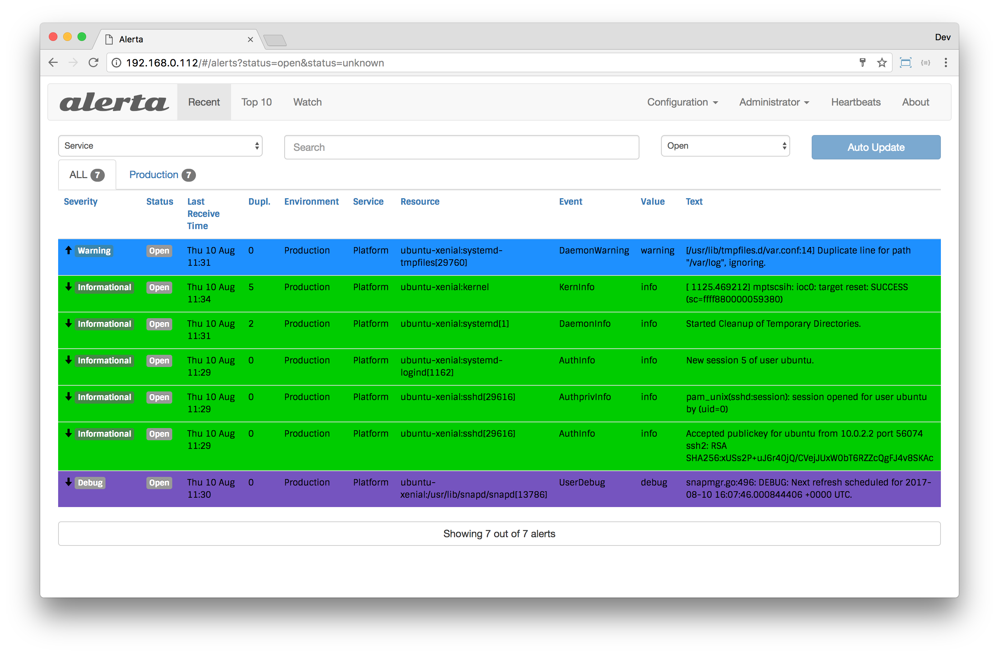

Syslog Integration
==================

Receive [RFC 5424](https://tools.ietf.org/html/rfc5424.html),
[RFC 3164](https://tools.ietf.org/html/rfc3164.html) syslog and
[Cisco syslog](http://www.cisco.com/c/en/us/td/docs/routers/access/wireless/software/guide/SysMsgLogging.html)
messages and forward to Alerta.

For help, join 

Installation
------------

Clone the GitHub repo and run:

    $ python setup.py install

Or, to install remotely from GitHub run:

    $ pip install git+https://github.com/alerta/alerta-contrib.git#subdirectory=integrations/syslog

Configuration
-------------

Use environment variables to configure `alerta-syslog`. To use non-standard
syslog ports:

    $ export SYSLOG_TCP_PORT=1514
    $ export SYSLOG_UDP_PORT=1514

To configure the API endpoint and API key (if required) set the following:

    $ export ALERTA_ENDPOINT=https://api.alerta.io
    $ export ALERTA_API_KEY=demo-key

NOTE: If using `rsyslog` and syslog msgs aren't being split on
newlines and `#012` appears instead then try adding
`$EscapeControlCharactersOnReceive off` to `rsyslog.conf`.

Testing
-------

To generate example syslog messages on a Mac follow the steps below:

    $ sudo vi /etc/syslog.conf

    *.* @127.0.0.1:514

    $ sudo launchctl unload /System/Library/LaunchDaemons/com.apple.syslogd.plist
    $ sudo launchctl load /System/Library/LaunchDaemons/com.apple.syslogd.plist

    $ sudo ALERTA_ENDPOINT=https://alerta.example.com ALERTA_API_KEY=demo-key alerta-syslog

    $ logger -i -s -p mail.err -t TEST "mail server is down"
    $ logger -p local0.notice -t HOSTIDM

References
----------

  * RFC 5424: https://tools.ietf.org/html/rfc5424.html
  * RFC 3164: https://tools.ietf.org/html/rfc3164.html
  * Cisco Syslog: http://www.cisco.com/c/en/us/td/docs/routers/access/wireless/software/guide/SysMsgLogging.htm
  * Rsyslog: http://www.rsyslog.com/

License
-------

Copyright (c) 2014-2016 Nick Satterly. Available under the MIT License.
