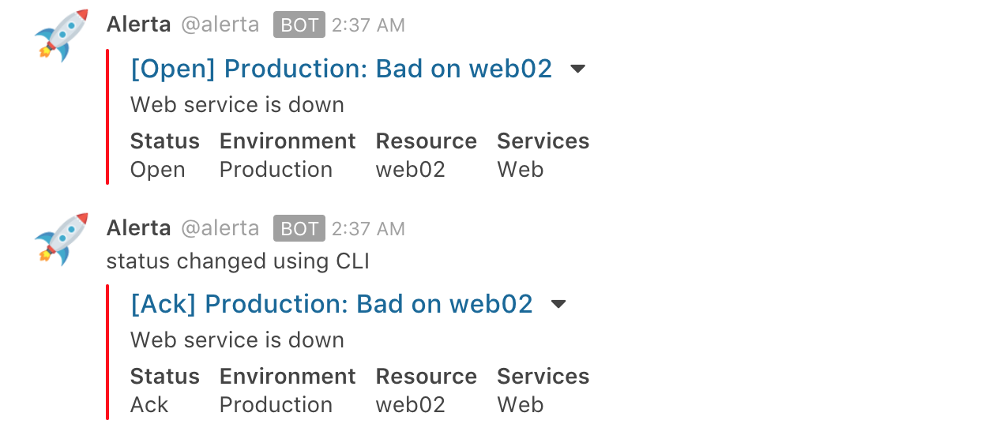

Rocket.Chat Plugin
==================

Post a [Rocket.Chat](https://rocket.chat) message for new alerts.



For help, join [](https://slack.alerta.dev)

Installation
------------

Clone the GitHub repo and run:

    $ python setup.py install

Or, to install remotely from GitHub run:

    $ pip install git+https://github.com/alerta/alerta-contrib.git#subdirectory=plugins/rocketchat

Note: If Alerta is installed in a python virtual environment then plugins
need to be installed into the same environment for Alerta to dynamically
discover them.

Configuration
-------------

To configure the Rocket.Chat plugin start by setting up an Incoming Webhook
integration for your Rocket.Chat channel. Login to Rocket.Chat and go to
"Administration" => "Integrations" => "New Integration" => "Incoming WebHook".

Enable the webhook, assign a webhook name, default channel (eg. `#general`)
and username to post messages as (which must already exist).


Note: No integration script is needed so leave the "Script" box blank and disabled.

Save the changes and take a copy of the webhook URL.

Add `rocketchat` to the list of enabled `PLUGINS` in `alertad.conf` server
configuration file and set plugin-specific variables either in the
server configuration file or as environment variables.

```python
PLUGINS = ['rocketchat']
ROCKETCHAT_WEBHOOK_URL = 'https://my.rocket.chat/hooks/TOKEN'
ROCKETCHAT_CHANNEL = ''  # if empty then uses channel from incoming webhook configuration

ICON_EMOJI = '' # default :rocket:
ALERTA_USERNAME = '' # default alerta
```

The `DASHBOARD_URL` setting should be configured to link Rocket.Chat messages to
the Alerta console:

```python
DASHBOARD_URL = ''  # default="not set"
```

**Example**

```python
PLUGINS = ['reject','rocketchat']
ROCKETCHAT_WEBHOOK_URL = 'https://alerta.rocket.chat/hooks/Ahqyy84yFB4DuWorQ/ZyndPtdbY5PCnaQGsXTJPCXbNC9bDiTL9L2Q7ktLnuHFYNKd'
DASHBOARD_URL = 'http://try.alerta.io'
```


Troubleshooting
---------------

Restart Alerta API and confirm that the plugin has been loaded and enabled.

Set `DEBUG=True` in the `alertad.conf` configuration file and look for log
entries similar to below:

```
2018-08-15 01:49:52,323 - alerta.plugins[36667]: DEBUG - Server plugin 'rocketchat' installed. [in /Users/nsatterl/Projects/alerta/alerta/utils/plugin.py:23]
2018-08-15 01:49:52,332 - alerta.plugins[36667]: INFO - Server plugin 'rocketchat' enabled. [in /Users/nsatterl/Projects/alerta/alerta/utils/plugin.py:31]
2018-08-15 01:49:52,332 - alerta.plugins[36667]: INFO - All server plugins enabled: reject, blackout, rocketchat [in /Users/nsatterl/Projects/alerta/alerta/utils/plugin.py:34]
```

An invalid Webhook URL or Auth Token can result in error messages similar to the following:

```
2018-08-15 01:47:14,751 - alerta.plugins.rocketchat[36569]: DEBUG - Rocket.Chat: {'channel': '', 'text': 'Web service is down', 'alias': 'Alerta', 'emoji': ':rocket:', 'attachments': [{'title': 'ddbfb0d0 Bad - Web service is down', 'title_link': 'http://localhost:8080/#/alert/ddbfb0d0-6c78-4c8e-b37f-2fca7bbc8d80', 'text': 'Web service is down', 'color': '#1E90FF', 'fields': [{'title': 'Status', 'value': 'Open', 'short': True}, {'title': 'Environment', 'value': 'Production', 'short': True}, {'title': 'Resource', 'value': 'web02', 'short': True}, {'title': 'Services', 'value': 'Web', 'short': True}]}]} [in /Users/nsatterl/.virtualenvs/alerta5-py3/lib/python3.6/site-packages/alerta_rocketchat-5.0.0-py3.6.egg/alerta_rocketchat.py:71]
2018-08-15 01:47:14,763 - urllib3.connectionpool[36569]: DEBUG - Starting new HTTPS connection (1): alerta.rocket.chat [in /Users/nsatterl/.virtualenvs/alerta5-py3/lib/python3.6/site-packages/urllib3/connectionpool.py:824]
2018-08-15 01:47:15,563 - urllib3.connectionpool[36569]: DEBUG - https://alerta.rocket.chat:443 "POST /hooks/D2oXe5wZEAKFYKds6/eQJ2dyMq6yPvAbNdx6uLjuiLJvQNSkSoWfQfi8kNwPQ6bsoc HTTP/1.1" 404 86 [in /Users/nsatterl/.virtualenvs/alerta5-py3/lib/python3.6/site-packages/urllib3/connectionpool.py:396]
2018-08-15 01:47:15,567 - alerta.plugins.rocketchat[36569]: DEBUG - Rocket.Chat: 404 - {"success":false,"error":"Invalid integration id or token provided."} [in /Users/nsatterl/.virtualenvs/alerta5-py3/lib/python3.6/site-packages/alerta_rocketchat-5.0.0-py3.6.egg/alerta_rocketchat.py:78]
```


References
----------

  * Rocket.Chat Incoming WebHooks: https://rocket.chat/docs/administrator-guides/integrations/index.html#how-to-create-a-new-incoming-webhook
  * Slack Message Attachments: https://api.slack.com/docs/message-attachments

License
-------

Copyright (c) 2018 Nick Satterly. Available under the MIT License.
