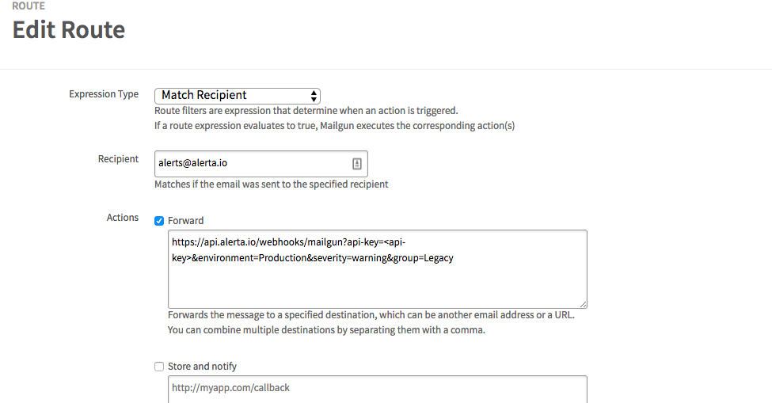

Mailgun incomming email Webhook
==============

Receive Emails using [Mailgun](https://documentation.mailgun.com/en/latest/quickstart-receiving.html) webhook callbacks.

For help, join 

Installation
------------

Clone the GitHub repo and run:

    $ python setup.py install

Or, to install remotely from GitHub run:

    $ pip install git+https://github.com/alerta/alerta-contrib.git#subdirectory=webhooks/mailgun

Note: If Alerta is installed in a python virtual environment then plugins
need to be installed into the same environment for Alerta to dynamically
discover them.

Configuration
-------------

The custom webhook receive incomming emails sent to an Mailgun account.

References
----------

  * Mailgun: https://documentation.mailgun.com/en/latest/quickstart-receiving.html

License
-------

Copyright (c) 2018 Anton Delitsch. Available under the MIT License.
